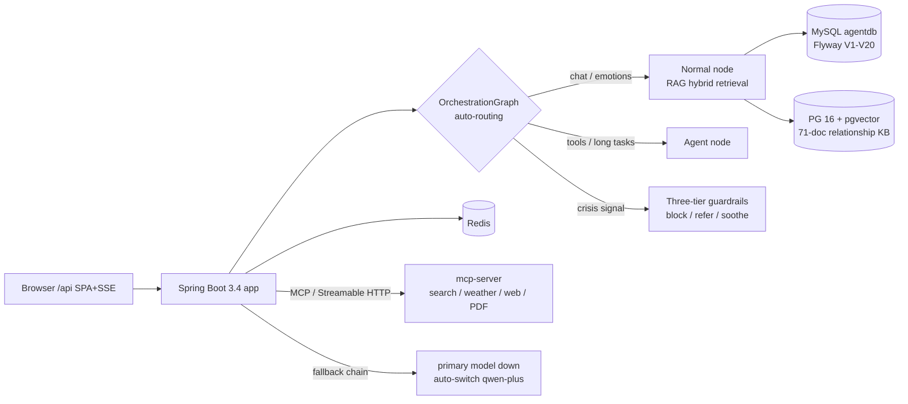

<p align="center">
  English · <a href="./README.md">简体中文</a>
</p>

<p align="center">
  
  
  
  
  
  
  
  
  
  
</p>

<h1 align="center">💌 LoveHelping</h1>

<p align="center">
  <b>An AI companion that actually listens — and gives you a straight answer when it matters.</b><br/>
  For the thoughts that keep you up at night · the words you can't say · the relationships you can't let go of — every one deserves a letter of its own.
</p>

<p align="center">
  <a href="#-features">Features</a> · <a href="#-quick-start">Quick Start</a> ·
  <a href="#-environment-variables">Environment Variables</a> · <a href="#-documentation">Documentation</a> ·
  <a href="#-architecture">Architecture</a> · <a href="#-safety--guardrails">Safety</a> ·
  <a href="#-quality--evaluation">Quality</a>
</p>

> LoveHelping is built on **Spring AI + multi-agent orchestration**: domain questions are answered from a curated knowledge base, task-style questions are auto-routed to agent tools, and emotional-crisis signals are caught by safety guardrails. Production-ready out of the box: `docker compose up -d` and you're live.

---

## ✨ Features

| | | |
|---|---|---|
| 💌 **Relationship counseling** | 🧭 **Auto-routing — no "easy/hard" split** | 🎭 **Role-play studio** |
| RAG over a curated 71-doc relationship library with **hybrid retrieval** (jieba tokenizer + RRF, plus pgvector semantic) — answers cite their sources | One graph dispatches everything: small talk / knowledge QA / tool tasks (`OrchestrationGraph`). The user just **"writes a letter"** | 8 preset personas + custom personality & relationship stage — **rehearse what you want to say** before you say it (the persona even has its own memory) |
| 🧠 **Long-term memory archive** | 🛡️ **Three-tier safety guardrails** | 🔧 **Agent tool surface** |
| Preferences & experiences distill into memory cards — review / **correct / delete** anytime; the AI grows to know you | Manipulation (PUA) detection · 24/7 crisis-keyword referral · late-night emotional brake — companionship with clear boundaries | Search / weather / web fetch / PDF / date ideas on an isolated MCP process — **tool failures don't cascade** |
| 🎮 **Typewriter UX end-to-end** | 🔁 **Self-evolution** | 🐳 **One-command deploy** |
| Not just answers — queue notices ("wait ~N s") and errors also render letter-by-letter; a warm letter-paper UI from home to profile | A reflection scheduler reviews conversations and versioned-prompts / skills (evolution_skill) | `Dockerfile × 2 + docker-compose`: MySQL / pgvector / Redis / MCP / App in one command |
| 🏠 **Profile** | 📚 **History archive** | 🖼 **Letter-paper design** |
| emoji avatar · nickname · bio · password change · account deletion | Review & continue past conversations | Handwritten-feel typography (KaiTi stack) & paper textures across all pages |

## 🖼 UI Overview

> Run the app and visit `http://localhost:8088/api/`. Entry points below (screenshots welcome via PR to `docs/screenshots/`):

| Entry | What it is | Route |
|---|---|---|
| 📮 The Letterbox | Unified conversation (auto-routing, typewriter + queue notice) | `/love-chat` |
| 🎭 Role-play Studio | Rehearse with a custom persona + manage that persona's memory | `/sandbox` |
| 🧠 Memory Archive | What the AI remembers about you: category / confidence / corrections | `/memory` |
| 🏠 My Corner | emoji avatar · nickname · bio · password · account deletion | `/profile` |
| 📚 Old Letters | Past conversations — revisit or continue | `/history` |

## 🚀 Quick Start

### A. Docker one-command deploy (recommended)

```bash
# 1. Prepare secrets
cp .env.example .env        # fill the 6 required keys (see env table below)

# 2. Build & start (first run pulls images + compiles)
docker compose up -d --build

# 3. Wait until ready (first PG vectorization takes ~3-10 min)
docker compose logs -f app

# 4. Open
open http://localhost:8088/api/
```

> ✅ First boot does everything automatically: MySQL Flyway migrations (V1-V20), PostgreSQL schema + **auto-vectorization of 71 docs** (incremental via doc_hash; restarts only sync changes).

### B. Local development

```bash
# Backend (default profile=local; needs local MySQL / PG(pgvector) / Redis + mcp-server:8125)
./mvnw spring-boot:run

# Frontend hot reload
cd front && npm install && npm run dev   # → http://localhost:5173 (proxy → backend /api)

# E2E smoke (needs backend running)
BASE_URL=http://localhost:8088/api ADMIN_API_KEY=xxx bash scripts/e2e-smoke.sh
```

## ⚙️ Environment Variables

| Variable | Required | Description | Example |
|---|---|---|---|
| `OPENAI_API_KEY` | ✅ | Primary LLM key (default Zhipu BigModel, glm-4-flash) | `xxxxxxxx.watMU...` |
| `DASHSCOPE_API_KEY` | ✅ | Retrieval embedding + fallback model (qwen-plus) | `sk-xxxx` |
| `JWT_SECRET` | ✅ | JWT signing secret, **≥32 random chars** (startup refuses to boot without it) | `openssl rand -hex 32` |
| `MYSQL_PASSWORD` | ✅ | MySQL root password (created on first boot) | `change-me` |
| `PGVECTOR_PASSWORD` | ✅ | PostgreSQL password (created on first boot) | `change-me` |
| `ADMIN_API_KEY` | ✅ | Admin endpoints, request header `X-Admin-Key` | `change-me` |
| `OPENAI_MODEL` / `OPENAI_BASE_URL` | ⭕ | Override primary model / endpoint | `glm-4.7` |
| `APP_PORT` | ⭕ | Public port | `8088` |

## 📚 Documentation

The full decision trail — from product to deployment — lives in `docs/` (including ADRs and technical rulings):

| Doc | Contents |
|---|---|
| [00 · Reading Guide](docs/00-文档导读.md) | Where to start |
| [01 · Product](docs/01-产品定位与需求.md) · [02 · Architecture](docs/02-架构设计.md) | Why & how |
| [03 · ADR Log](docs/03-技术决策记录.md) | 20+ technical rulings (why parent-child indexing was dropped, how the fallback chain landed…) |
| [07 · Security](docs/07-安全与合规.md) | Content safety / data compliance / off-domain policy |
| [08 · Observability](docs/08-可观测性与发布.md) · [09 · Testing](docs/09-测试策略.md) | Metrics / trace / load-test NFRs |
| [10 · Deploy](docs/10-部署发布.md) | Docker orchestration / **CD pipeline** / **Ops runbook** (backup-restore · Sentry · secret rotation) / FAQ |

## 🏗 Architecture



- **Routing**: the frontend never asks "simple vs complex" — `classify` dispatches server-side by intent; RAG / tools / plain chat are invisible to the user.
- **Memory**: conversations distill into facts → the memory archive; each sandbox persona keeps its own memory context.
- **Tool surface**: `mcp-server` runs as an isolated process (port 8125) called over HTTP — tool failures never take down chat.
- **Frontend**: Vue 3 + Vite, compiled into the backend static dir → single-jar delivery.

## 🛡 Safety & Guardrails

Unlike a generic "AI chat shell", this project turns *boundaries* into product:

| Layer | Mechanism |
|---|---|
| 🚨 Crisis (L3) | Self-harm / suicidal keywords **hard-blocked 24/7** + professional referral copy (with a continuously growing list of colloquial variants) |
| 🧊 Emotional brake | Late-night fragility signals auto-trigger soothing mode instead of canned scripts |
| 🚷 Manipulation | PUA / gaslighting pattern detection + intimate-partner-violence content compliance (V17 intent guardrails) |
| 🔌 Off-domain | Non-relationship requests rejected by rules (zero LLM cost, prompt-exfiltration resistant) |
| 🔐 Engineering | JWT fail-fast (no fallback secret) · SSRF / path-traversal guards · fault-injection-tested fallback chain · concurrency gate (fast reject with wait estimate) |

## 📊 Quality & Evaluation

All automation assets ship with the repo (`scripts/`):

- 🎯 **Retrieval eval**: 45 ground-truth cases — production baseline **Recall 1.00 / MRR 0.911**
- 🧪 **Answer eval**: 16 golden × 3 rounds (multi-hop expectations included)
- 🤖 **Agent eval**: 6 classes × 3-layer boundaries (tool calls / off-domain / content safety) all pass
- 🚀 **E2E smoke**: 18 items (register → SSE typewriter → RAG → Agent → guardrails → fallback) one-command regression
- ⚡ **Capacity, measured**: 40 concurrent, zero 429s (no vendor hard limit); gate default 24 in-flight (P95 ≈3.5 s sweet spot); 50 SSE long-lived connections, zero drops

### Engineering & Ops (enterprise hardening, 2026-09-07)

- ✅ **105 unit tests**: a second-level regression net for the API layer — Auth(10) / Sandbox(7) / MemoryFacts(7) contracts + RBAC interceptor (4 states). Unauthorized 403/404, not-logged-in 401 — all pinned
- 🔄 **CI, three pipelines** (GitHub Actions): `gitleaks` secret scan (full history) → `mvn test` → E2E 18 items (mysql/pgvector/redis service containers; full regression runs once Secrets are configured)
- 📦 **CD**: `git tag v*` → build & push both images to GHCR → (optional) ssh auto-deploy; `TAG=<old-version>` one-command rollback
- 📜 **Audit log**: sensitive actions (login / password change / account deletion) appended to an immutable table, queryable via `/admin/audit` — who did what, when, with receipts
- 🧯 **Disaster recovery**: 3-2-1 backup script (`ops/backup.sh`, 7-day rotation) + restore-drill runbook + Sentry error tracking (enable by setting `SENTRY_DSN`)
- 🔐 **RBAC**: method-level `@RequireRole`, enforced in the interceptor (not just hidden menu items) — the permission base for future ADMIN capabilities

## 🗂 Repository Layout

```
├── src/main/java/cn/lwx/lwxaiagent
│   ├── agent/               # Agent tools (search / weather / web / PDF…)
│   ├── infrastructure/      # LLM gateway (fallback chain), graph orchestration, schedulers
│   ├── rag/                 # Hybrid retrieval (jieba RRF + pgvector), KB sync
│   ├── sandbox/  memory/    # Role-play studio / memory distillation
│   ├── harness/             # Guardrails (governance), observability, eval
│   └── controller/          # REST + SSE API (/api prefix)
├── front/src               # Vue 3 frontend (letter-paper UI)
├── mcp-server/             # Isolated tool process (own Docker build)
├── scripts/                # Eval / smoke / load-test assets
├── docs/                   # Product → architecture → ADR → deploy decision trail
└── docker-compose.yml      # One-command deploy
```

## 🤝 Contributing

The project is in its V1 release phase. We welcome:

- 🐛 Bug reports — especially colloquial crisis-phrase variants and ground-truth samples for RAG misses
- 💡 New persona templates / knowledge-base content
- 📸 Screenshots & visual polish

Before submitting, run `scripts/e2e-smoke.sh` — all 18 items must pass.

---

<p align="center">
  <sub>Every heartache at midnight deserves a letter of its own.</sub><br/>
  <a href="#">↑ Back to top</a>
</p>
