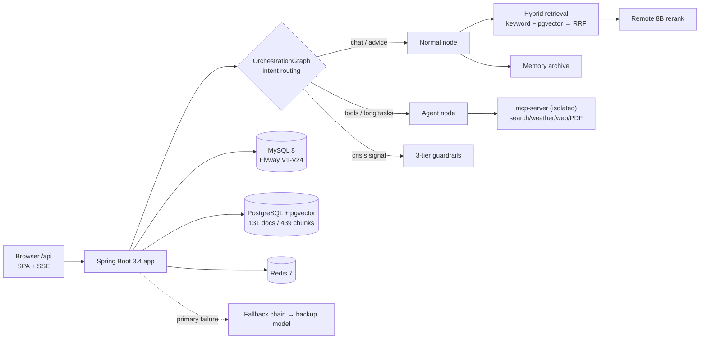

<p align="center">
  <b>English</b> · <a href="./README.md">简体中文</a>
</p>

<p align="center">
  
  
  
  
  
  
  
  
  
  
</p>

<h1 align="center">💌 LoveHelping</h1>

<p align="center">
  <b>An emotional-companionship service on Spring AI — bounded listening, memory that accumulates, and no mode-switching asked of the user.</b>
</p>

<p align="center">
  <a href="#-why-this-exists">Why</a> · <a href="#-core-capabilities">Capabilities</a> ·
  <a href="#-ui-overview">UI</a> · <a href="#-quick-start">Quick Start</a> ·
  <a href="#-architecture">Architecture</a> · <a href="#-engineering-quality">Quality</a> ·
  <a href="#-documentation">Docs</a> · <a href="#-roadmap">Roadmap</a>
</p>

---

> **LoveHelping is not a chat wrapper.** It turns three things that are usually hand-waved into product capabilities:
> **① users never have to decide "should this hit the knowledge base or a tool"** (intent is routed server-side);
> **② content safety is a layered boundary, not a system prompt** (crisis intervention / manipulation detection / off-topic rejection, active 24/7);
> **③ evaluation has ground truth, control experiments and calibrated instruments** (45 retrieval cases, 16 answer-judging cases, 295 unit tests, 22 real E2E checks).
> `docker compose up -d` brings up the whole stack.

## 🎯 Why this exists

Late at night, most people reach for two things: **a search box**, or **a message to someone who won't reply**.

Neither fits. Psychological explainers are accurate and cold — you finish reading and feel lonelier.
General-purpose LLMs are unstable at both ends: they either agree with everything (sometimes coaching you into
manipulating the other person), or they fail to catch a genuinely dangerous signal. **Companionship and boundaries
are usually framed as opposites.**

LoveHelping aims at something narrower: **a companion entry point that has boundaries, remembers you, and never
makes you pick a mode.**

- 🚧 **Bounded** — crisis intervention, manipulation (PUA) detection and off-topic rejection are three independent
  mechanisms, not a prompt patched on afterwards.
- 🧠 **Remembers** — conversations distil into a memory archive (category + confidence) the user can
  **review, correct and delete**.
- 🎯 **No mode-picking** — RAG QA / tool tasks / plain chat are dispatched server-side; the user just *writes a letter*.

## ✨ Core capabilities

**1. The Letterbox — one graph, routed server-side**
`classify` dispatches by intent: knowledge questions go to RAG, long tool tasks to the Agent, small talk straight through.
The frontend has no "easy/hard" switch — routing is invisible to the user, and error paths share the same response contract.

**2. A hybrid-retrieval knowledge base with remote reranking**
131 curated relationship articles (**439 semantic chunks**). Recall runs as a **two-channel RRF fusion**
(jieba keyword + pgvector semantic neighbours), then a **Qwen3-Reranker-8B** cross-encoder reorders the candidates.
Answers carry source references and relevance scores.
> Reranking is quantifiable here: same setup, **MRR@5 0.714 → 0.885 (+0.17)** with Recall unchanged — a reranker
> reorders, it does not change the recall set.

**3. Long-term memory archive**
Facts are distilled from conversations (with category and confidence) and accumulate into cross-session personalization.
Memory is **manageable**: view, correct, delete — not an invisible "the AI remembers things" black box.

**4. Role-play studio (rehearsal)**
8 preset personas plus custom personality / relationship-stage sessions. Each persona keeps an **isolated memory
context** — useful for low-risk rehearsal of *"what happens if I say this?"*

**5. Three-tier safety guardrails**
| Tier | Mechanism |
|---|---|
| 🚨 Crisis intervention | Self-harm / suicidal signals **hard-blocked 24/7** + professional referral copy (colloquial-variant lexicon) |
| 🚷 Manipulation detection | PUA / gaslighting patterns blocked; intimate-partner-violence content policy |
| 🔌 Off-topic rejection | Non-relationship requests rejected by **rules, at zero LLM cost** — prompt-escalation defence |

> Guardrails are themselves **observable and greyscale-able**: a three-state switch (`off` / `shadow` / `enforce`),
> where `shadow` judges and records but **never alters the response** — measure the real false-positive rate first,
> then decide whether to enforce.

**6. Agent tool surface (isolated process)**
Search / weather / web fetch / PDF generation / date planning live in a **separate MCP service** reached over HTTP —
**tool failures do not cascade into chat failures**.

**7. Multi-provider with config-level rollback**
The main chat model speaks the OpenAI-compatible protocol (swap the endpoint freely); embedding and reranking each have
**two switchable channels**. Changing providers is an environment variable plus a restart — **migration and rollback are
first-class, not one-off scripts**.

**8. Observability and self-healing**
Prometheus metrics plus self-hosted Langfuse tracing; the LLM gateway carries a **fallback chain** (primary failure
switches to a backup model) and circuit breakers. The export boundary drops security-filter spans by name, so
**auth details never reach the observability platform**.

## 🖼 UI overview

> Single-jar delivery: the frontend build is compiled into the backend's static directory. Run the app and
> `http://localhost:8088/api/` is the full UI (Vue 3, "letter-paper" theme — handwritten-feel typography and paper textures).

| Entry | What it is | Route |
|---|---|---|
| 📮 The Letterbox | Unified conversation entry (auto-routing · SSE streaming · queue notice) | `/love-chat` |
| 🎭 Role-play Studio | Sandbox sessions: persona rehearsal + per-session memory | `/sandbox` |
| 🧠 Memory Archive | What the AI remembers about you: category / confidence / corrections | `/memory` |
| 📚 Old Letters | Past conversations — revisit or continue | `/history` |
| 🏠 My Corner | emoji avatar · nickname · bio · password · account deletion | `/profile` |

## 🚀 Quick start

### A. Docker (recommended)

```bash
# 1. Prepare secrets
cp .env.example .env          # fill in the required entries below

# 2. Build & start (first run pulls images and compiles)
docker compose up -d --build

# 3. Wait until ready (first full PG vectorization takes ~3-10 min)
docker compose logs -f app

# 4. Open
open http://localhost:8088/api/
```

> ✅ First start handles it all: MySQL **Flyway V1–V24** migrations, PostgreSQL schema and indexes,
> and **automatic chunking + vectorization of 131 documents** (afterwards incremental by `doc_hash`,
> so restarts only process changed documents).

### B. Local development

```bash
# Backend (default profile=local; needs local MySQL / PostgreSQL(pgvector) / Redis + mcp-server:8125)
./mvnw spring-boot:run

# Frontend hot reload
cd front && npm install && npm run dev    # → http://localhost:5173 (proxies /api to the backend)

# Smoke regression (backend must be running)
BASE_URL=http://localhost:8088/api ADMIN_API_KEY=xxx bash scripts/e2e-smoke.sh
```

## ⚙️ Environment variables

| Variable | Required | Notes |
|---|---|---|
| `OPENAI_API_KEY` / `OPENAI_BASE_URL` / `OPENAI_MODEL` | ✅ | Main chat model (OpenAI-compatible endpoint; may be self-hosted/gateway) |
| `DASHSCOPE_API_KEY` | ✅ | Backup model used by the fallback chain |
| `SF_API_KEY` | ⭕ | Shared key for embedding + remote rerank (default channel) |
| `JWT_SECRET` | ✅ | Signing key, **≥32 random chars** — missing or short **refuses to start** |
| `MYSQL_PASSWORD` / `PGVECTOR_PASSWORD` | ✅ | Primary DB / vector DB passwords |
| `ADMIN_API_KEY` | ✅ | Admin endpoint header `X-Admin-Key` |
| `MCP_SERVER_URL` | ⭕ | Tool surface address (default `http://localhost:8125/mcp`) |
| `RAG_EMBEDDING_PROVIDER` / `RERANK_ENABLED` | ⭕ | Retrieval channel / rerank toggles (for rollback, see `docs/11`) |
| `APP_PORT` | ⭕ | Public port (default 8088) |

## 🏗 Architecture



- **Routing** — `classify` dispatches by intent; RAG / tools / plain chat stay transparent to the user.
- **Retrieval** — keyword and semantic channels fuse via RRF, then the reranker reorders. Source filtering is
  **pushed down into SQL** (knowledge chunks and user memories share one table and one ANN index, so "fetch k then filter"
  is wrong).
- **Tools** — MCP runs as its own process; failures stay isolated.
- **Delivery** — Vue 3 + Vite output is compiled into the backend's static directory: one jar.

## 📊 Engineering quality

Evaluation assets **ship with the repository**, and they are the reproducible, falsifiable kind:

| Asset | Scale / result |
|---|---|
| 📐 Architecture Decision Records | **47 ADRs** (`docs/03`) — including revision notes on conclusions that were later overturned (history is annotated, not rewritten) |
| 🗄 Database migrations | **24 Flyway migrations (V1–V24)** — DDL only via migrations, never hand-edited schema |
| ✅ Unit tests | **295, all green** |
| 🧪 Real E2E | **22 checks** over real HTTP / SSE / database — no mocks |
| 🎯 Retrieval evaluation | 45 ground-truth cases: **Recall@5 0.96 · MRR@5 0.885** (production config) |
| 💬 Answer quality | 16 cases × 3 rounds, LLM-judged: **0.89** — with a defect-vs-fixed control: **0.35 → 0.89** |
| ⚡ Measured capacity | Vendor ceiling on the LLM channel **≈24 concurrent** (excess is rejected immediately with 429); embedding ≥64 and rerank ≥32 saw no 429 |
| 🧰 Evaluation scripts | **62** (retrieval / answers / agent / guardrails / load / upstream probing), all maintained in-repo |

**Methodology we deliberately hold to** (each of these was learned the hard way):

- 🧪 **Every behavioural assertion needs a control experiment** — break it → it must fail precisely → restore → full green.
  "It passed" is not proof.
- 📏 **Calibrate the instrument before measuring** — establish same-arm reproducibility first, then state the
  **instrument resolution** (±0.015 MRR here) and refuse to judge effects smaller than it.
- 🧾 **Decision thresholds are written down before the run**, never after; cross-period comparisons
  check that the definitions match first.
- 🔎 **"Wired up" ≠ "carried correctly"** — when replacing a component with a return contract, verify field by field
  (id / text / metadata / score). This is the most expensive of the 47 ADRs.

### 🔧 Operations & compliance

- 📜 **Audit log** — sensitive operations (login / password change / account deletion / deletes) are written
  **append-only** (`AuditAspect` + Flyway `V20`) and queryable at `/admin/audit`: who did what, when.
- 🧯 **Disaster recovery** — 3-2-1 backup script (`ops/backup.sh`, daily rotation) plus a restore runbook;
  error tracking via Sentry, enabled by setting `SENTRY_DSN`.
- 🔐 **Method-level RBAC** — `@RequireRole` is **actually enforced** by an interceptor (not hidden menu items);
  403 for unauthorized and 401 for anonymous are pinned by contract tests.
- 📈 **Observability stack** — Prometheus metrics + Grafana dashboards (`ops/grafana`) + self-hosted Langfuse tracing.

## 📚 Documentation

The whole decision chain — product → architecture → ADR → deployment — lives in `docs/`:

| Document | Contents |
|---|---|
| [00 · Reading guide](docs/00-文档导读.md) | Entry points by role |
| [01 · Product](docs/01-产品定位与需求.md) · [02 · Architecture](docs/02-架构设计.md) | Why, and how it is put together |
| [03 · ADRs](docs/03-技术决策记录.md) | **47 ADRs** — why parent-child indexing was dropped, how the fallback chain landed, why filtering had to be pushed down… |
| [04 · Data model](docs/04-数据模型设计.md) · [05 · API contracts](docs/05-API契约设计.md) · [06 · Core flows](docs/06-核心流程设计.md) | Schema / endpoints / sequences |
| [07 · Security & compliance](docs/07-安全与合规.md) | Content safety · data compliance · ownership checks |
| [08 · Observability](docs/08-可观测性与发布.md) · [09 · Test strategy](docs/09-测试策略.md) | Metrics & tracing / test layers and NFRs |
| [10 · Deployment](docs/10-部署发布.md) · [11 · Environment](docs/11-环境与装置.md) | Docker / CD / DR runbook · local harness and script index |

## 🗂 Repository layout

```
├── src/main/java/cn/lwx/lwxaiagent
│   ├── agent/               # Agent tools (search/weather/web/PDF…)
│   ├── infrastructure/      # LLM gateway (fallback chain, circuit breaker), graph orchestration, schedulers
│   ├── rag/                 # Hybrid retrieval (RRF), rerank, KB sync, SQL search entry points
│   ├── sandbox/  memory/    # Role-play studio / memory extraction and archive
│   ├── harness/             # Guardrails (governance), observability
│   └── controller/          # REST + SSE API (/api prefix)
├── front/src               # Vue 3 frontend (letter-paper theme)
├── mcp-server/             # Isolated tool-process (own Docker build)
├── scripts/                # Evaluation / smoke / load assets (62)
├── docs/                   # Product → architecture → ADR → deployment
└── docker-compose.yml      # One-command deployment
```

## 🗺 Roadmap

- [x] **V1** core chain: auto-routing · hybrid RAG · memory archive · three-tier guardrails · real E2E regression net
- [x] Remote reranking in production, plus a **multi-provider rollback channel**
- [ ] Screenshots and visual polish (the "letter-paper" theme deserves a proper gallery — PRs welcome)
- [ ] Multi-instance deployment (capacity governance is currently in-process; an ADR comes first)
- [ ] Knowledge-base growth and content co-building (relationship articles, colloquial crisis variants)
- [ ] Plugin-able tool surface (third-party tools over the MCP protocol)

## 🤝 Contributing

Three kinds of contributions, all easy to start with:

- 🐛 **Bug reports** — especially "this crisis phrasing slipped through" and "RAG should have recalled this but didn't".
  Such samples go straight into the evaluation set.
- 💡 **Content and personas** — knowledge-base articles and persona templates.
- 📸 **UI and visuals** — screenshots, theme polish, accessibility.

Before submitting:

```bash
./mvnw test                                                # 295 unit tests
BASE_URL=... ADMIN_API_KEY=... bash scripts/e2e-smoke.sh   # 22 real E2E checks
```

> 🔐 **Security disclosure** — please **do not** post vulnerability details in public issues; contact the author directly.
> 🔑 All secrets are injected via environment variables. The repository runs a full-history `gitleaks` scan
> (the CI `security` workflow) that is **not allowed to be bypassed**.

---

<p align="center">
  <sub>Every 3 a.m. dilemma deserves a letter of its own.</sub><br/>
  <a href="#">↑ Back to top</a>
</p>
