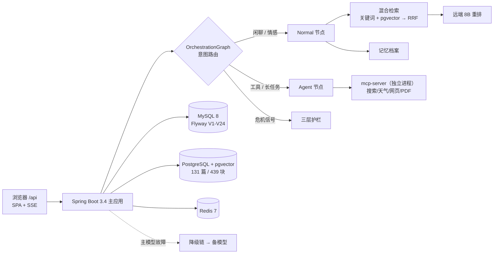

<p align="center">
  <a href="./README.en.md">English</a> · <b>简体中文</b>
</p>

<p align="center">
  
  
  
  
  
  
  
  
  
  
</p>

<h1 align="center">💌 LoveHelping · 恋爱解忧</h1>

<p align="center">
  <b>基于 Spring AI 的情感陪伴服务 —— 有边界的倾听、会积累的记忆、不必选模式的入口。</b>
</p>

<p align="center">
  <a href="#-为什么做这个">为什么做</a> · <a href="#-核心能力">核心能力</a> ·
  <a href="#-界面一览">界面</a> · <a href="#-快速开始">快速开始</a> ·
  <a href="#-系统架构">架构</a> · <a href="#-工程质量">工程质量</a> ·
  <a href="#-文档">文档</a> · <a href="#-路线图">路线图</a>
</p>

---

> **LoveHelping 不是一个"套壳聊天框"。** 它把三件通常被含糊过去的事做成了产品能力：
> **① 用户不必判断"这该问知识库还是调工具"**（意图在服务端自动路由）；
> **② 内容安全是分层的边界，而不是一句系统提示词**（危机干预 / 操控识别 / 域外拦截三层，24h 生效）；
> **③ 评测有真值、有对照、有量具标定**（检索 45 例 + 答案 16 例判分，295 项单测、22 项真实 E2E）。
> `docker compose up -d` 即可拉起完整栈。

## 🎯 为什么做这个

深夜的情感动摇，多数人的第一反应是**搜一下**、或者**发给一个不会回的人**。

可选项都不太合适：心理科普太冷，读完更孤独；泛用大模型两头都不稳 —— 要么顺着你说、甚至教你操控对方，
要么在真正的危险信号面前一样接不住。**"陪伴"和"边界"经常被当成一对矛盾。**

LoveHelping 想做的是更窄的一件事：**一个有边界、会记住你、且不逼你选模式的陪伴入口。**

- 🚧 **有边界**：危机干预、操控（PUA）识别、域外请求拦截是三层独立机制，不是事后补的提示词；
- 🧠 **会记住**：对话自动沉淀为记忆档案（分类 + 置信度），你能**核对、修正、删除**；
- 🎯 **不逼你选**：RAG 问答 / 工具任务 / 纯聊天在服务端自动分发，用户只需要"写一封信"。

## ✨ 核心能力

**1. 解忧信箱：一张图自动分发，用户不选模式**
`classify` 在服务端按意图路由 —— 知识问答走 RAG、工具类长任务走 Agent、闲聊直达。
前端不做"简单/困难"之分，切换对用户完全透明。

**2. 混合检索 + 远端重排的知识库**
131 篇精选中文情感内容（**439 个语义块**），召回走**双通道 RRF 融合**（jieba 分词关键词 + pgvector 语义近邻），
再用 **Qwen3-Reranker-8B** 做交叉编码重排。回答附来源与相关性打分。
> 重排的价值是可量化的：同口径下 **MRR@5 0.714 → 0.885（+0.17）**，Recall 不变 —— 精排只改排序，不改召回集合。

**3. 长期记忆档案**
对话自动萃取事实（带分类与置信度）→ 沉淀为记忆条目 → 跨会话个性化随使用累积。
记忆是**可管理**的：用户可查看、修正、删除，而不是一团不可见的"AI 记忆"。

**4. 角色模拟屋（沟通排练）**
预置 8 种人设 + 支持自定义性格与关系阶段；每个 TA 拥有**独立记忆上下文**，
可用于"这句话说出口会怎样"的低风险排练。

**5. 三层安全护栏**
| 层 | 机制 |
|---|---|
| 🚨 危机干预 | 自伤 / 轻生类信号 **全天 24h 硬阻断** + 专业转介话术（含口语变体库） |
| 🚷 操控识别 | PUA / 煤气灯话术识别与阻断；亲密关系暴力内容合规拦截 |
| 🔌 域外拦截 | 非情感领域请求**规则化拒绝，零 LLM 成本**，防提示词越权 |

> 护栏本身也是**可观测、可灰度**的：三态开关（`off` / `shadow` / `enforce`），
> `shadow` 只判定与落库、**绝不改变响应** —— 先量真实误报率，再决定要不要拦。

**6. Agent 工具面（独立进程）**
搜索 / 天气 / 网页抓取 / PDF 生成 / 约会方案由**独立 MCP 服务**承载，主应用经 HTTP 调用 ——
**工具故障不会放大成聊天故障**。

**7. 多供应商 + 配置级回滚**
主对话模型走 OpenAI 兼容协议（可换端点）；embedding 与 rerank 有**双通道**可选（硅基流动 / DashScope），
切换只改环境变量 + 重启。**迁移与回滚都是一等公民**，不是一次性脚本。

**8. 可观测与自愈**
Prometheus 指标 + 自托管 Langfuse trace；LLM 网关带**降级链**（主模型故障自动切换备模型）与
**熔断器**。导出边界按 span 名丢弃安全过滤链，**鉴权细节不会进观测平台**。

## 🖼 界面一览

> 单 jar 交付：前端构建产物打进后端静态目录，启动后访问 `http://localhost:8088/api/` 即是完整界面（Vue 3 + 纸感主题）。

| 入口 | 定位 | 路由 |
|---|---|---|
| 📮 解忧信箱 | 统一对话入口（自动路由 · SSE 流式 · 超限排队告知） | `/love-chat` |
| 🎭 角色模拟屋 | 沙盘会话：人设排练 + 会话独立记忆 | `/sandbox` |
| 🧠 记忆档案 | AI 记住的关于你的事：分类 / 置信度 / 修正 | `/memory` |
| 📚 旧信存档 | 历史会话回顾与续写 | `/history` |
| 🏠 我的小窝 | 头像 · 昵称 · 签名 · 改密码 · 注销 | `/profile` |

## 🚀 快速开始

### A. Docker 一键部署（推荐）

```bash
# 1. 准备密钥
cp .env.example .env          # 填入下方"必填"项

# 2. 构建并启动（首次自动拉镜像 + 编译）
docker compose up -d --build

# 3. 等就绪（首次 PG 全量向量化约 3-10 分钟）
docker compose logs -f app

# 4. 打开
open http://localhost:8088/api/
```

> ✅ 首次启动自动完成：MySQL **Flyway V1–V24** 迁移、PostgreSQL 建表与索引、
> **131 篇文档自动切块 + 向量化**（之后按 `doc_hash` 增量同步，重启只处理变更文档）。

### B. 本地开发

```bash
# 后端（默认 profile=local；依赖本地 MySQL / PostgreSQL(pgvector) / Redis + mcp-server:8125）
./mvnw spring-boot:run

# 前端热更新
cd front && npm install && npm run dev    # → http://localhost:5173（proxy 到后端 /api）

# 冒烟回归（需后端在跑）
BASE_URL=http://localhost:8088/api ADMIN_API_KEY=xxx bash scripts/e2e-smoke.sh
```

## ⚙️ 环境变量

| 变量 | 必填 | 说明 |
|---|---|---|
| `OPENAI_API_KEY` / `OPENAI_BASE_URL` / `OPENAI_MODEL` | ✅ | 主对话模型（OpenAI 兼容端点，可为自建/网关） |
| `DASHSCOPE_API_KEY` | ✅ | 备模型（主模型故障时降级链切到它） |
| `SF_API_KEY` | ⭕ | 硅基流动 key：embedding 与远端 rerank 共用（默认通道） |
| `JWT_SECRET` | ✅ | 签名密钥，**≥32 字符随机串**（缺失或过短**拒绝启动**） |
| `MYSQL_PASSWORD` / `PGVECTOR_PASSWORD` | ✅ | 主数据源 / 向量库密码（首启创建） |
| `ADMIN_API_KEY` | ✅ | 管理端点请求头 `X-Admin-Key` |
| `MCP_SERVER_URL` | ⭕ | 工具面地址（默认 `http://localhost:8125/mcp`） |
| `RAG_EMBEDDING_PROVIDER` / `RERANK_ENABLED` | ⭕ | 切检索通道 / 开关重排（回滚用，见 `docs/11`） |
| `APP_PORT` | ⭕ | 对外端口（默认 8088） |

## 🏗 系统架构



- **路由**：`classify` 按意图分发 —— RAG / 工具 / 纯聊天对用户透明。
- **检索**：关键词与语义**双通道 RRF 融合**，再交给重排做精排；源过滤**下推到 SQL**（知识块与用户记忆同表共用索引，不能"先取 k 再筛"）。
- **工具面**：MCP 独立进程，故障隔离。
- **交付**：Vue 3 + Vite 构建产物编译进后端静态目录，单 jar。

## 📊 工程质量

这个项目的评测资产**随仓库一起维护**，而且是"能复现、能证伪"的那种：

| 资产 | 规模 / 结果 |
|---|---|
| 📐 技术决策记录（ADR） | **47 条**（`docs/03`，含被推翻结论的修订标注 —— 不改写历史） |
| 🗄 数据库迁移 | **24 次 Flyway（V1–V24）**，DDL 只走迁移，不手改 schema |
| ✅ 单元测试 | **295 项全绿** |
| 🧪 真实 E2E | **22 项**（真实 HTTP / SSE / 数据库，非 mock） |
| 🎯 检索评测 | 45 例 ground-truth：**Recall@5 0.96 · MRR@5 0.885**（生产配置） |
| 💬 答案质量 | 16 例 × 3 轮 LLM 判分：**0.89**（并做过"缺陷前 / 修复后"对照：**0.35 → 0.89**） |
| ⚡ 容量实测 | LLM 通道厂商并发上限 **≈24**（超出立即 429）；embedding ≥64、rerank ≥32 无 429 |
| 🧰 评测脚本 | **62 个**（检索 / 答案 / Agent / 护栏 / 压测 / 上游探测），全部随仓库维护 |

**方法论上刻意守的几条**（也都是踩过坑才写下的）：

- 🧪 **行为断言必须带对照实验** —— 改坏 → 精确失败 → 恢复 → 复跑全绿，才算证明；"跑通"不等于"证明"。
- 📏 **量具先标定，再量** —— 先求同臂可复现，把**仪器分辨率**（本次 ±0.015 MRR）写进结论，不用它去判更小的效应。
- 🧾 **判定阈值事先写死**，事后不改；跨期比较先核对口径。
- 🔎 **"接上了" ≠ "传对了"** —— 换掉有返回契约的组件时逐字段核对载荷（这条正是 47 条 ADR 里最贵的一条）。

### 🔧 运维与合规

- 📜 **审计日志**：敏感操作（登录 / 改密 / 注销 / 删除）**append-only 落表**（`AuditAspect` + Flyway `V20`），`/admin/audit` 可查——谁在几点做了什么都有据可查。
- 🧯 **灾备**：3-2-1 备份脚本（`ops/backup.sh`，按日轮转）+ 恢复演练手册；错误追踪接 Sentry，填 `SENTRY_DSN` 即启用。
- 🔐 **方法级 RBAC**：`@RequireRole` 由拦截器**真校验**（不是前端藏菜单），越权 403 / 未登录 401 均有契约测试钉死。
- 📈 **可观测栈**：Prometheus 指标 + Grafana 面板（`ops/grafana`）+ 自托管 Langfuse trace。

## 📚 文档

从需求到部署的完整决策链沉淀在 `docs/`（含 ADR 与选型裁决，**结论被推翻时加修订标注而非删除**）：

| 文档 | 内容 |
|---|---|
| [00 · 文档导读](docs/00-文档导读.md) | 阅读路线图（按角色给入口） |
| [01 · 产品定位](docs/01-产品定位与需求.md) · [02 · 架构设计](docs/02-架构设计.md) | 为什么做 / 怎么搭 |
| [03 · 技术决策记录](docs/03-技术决策记录.md) | **47 条 ADR**：父子索引为何放弃、降级链怎么落地、过滤为何要下推…… |
| [04 · 数据模型](docs/04-数据模型设计.md) · [05 · API 契约](docs/05-API契约设计.md) · [06 · 核心流程](docs/06-核心流程设计.md) | 表结构 / 接口 / 时序 |
| [07 · 安全与合规](docs/07-安全与合规.md) | 内容安全 · 数据合规 · 越权校验 |
| [08 · 可观测](docs/08-可观测性与发布.md) · [09 · 测试策略](docs/09-测试策略.md) | 指标与 trace / 测试分层与 NFR |
| [10 · 部署发布](docs/10-部署发布.md) · [11 · 环境与装置](docs/11-环境与装置.md) | Docker 编排 / CD / 灾备手册 · 本地装置与评测脚本清单 |

## 🗂 目录结构

```
├── src/main/java/cn/lwx/lwxaiagent
│   ├── agent/               # Agent 工具面（搜索/天气/网页/PDF…）
│   ├── infrastructure/      # LLM 网关（降级链·熔断）、图编排、调度器
│   ├── rag/                 # 混合检索（RRF）、重排、知识库同步、SQL 查询入口
│   ├── sandbox/  memory/    # 角色模拟屋 / 记忆萃取与档案
│   ├── harness/             # 护栏（governance）、可观测
│   └── controller/          # REST + SSE API（/api 前缀）
├── front/src               # Vue 3 前端（纸感主题 UI）
├── mcp-server/             # 独立工具面进程（Docker 单独构建）
├── scripts/                # 评测 / 冒烟 / 压测资产（62 个）
├── docs/                   # 产品 → 架构 → ADR → 部署 全决策链
└── docker-compose.yml      # 一键部署
```

## 🗺 路线图

- [x] **V1** 核心链路：自动路由 · RAG 混合检索 · 记忆档案 · 三层护栏 · 真实 E2E 回归网
- [x] 检索精排上线（远端 8B rerank）与**多供应商回滚通道**
- [ ] 界面截图与视觉打磨（当前主题为「纸感」，欢迎 PR 补充截图）
- [ ] 多实例部署（当前容量治理为进程内状态，需先立 ADR）
- [ ] 知识库扩容与内容共建（欢迎投稿情感内容与口语化危机变体）
- [ ] 工具面插件化（在 MCP 协议上开放第三方工具）

## 🤝 贡献

欢迎三类贡献，都很好上手：

- 🐛 **报 bug**：尤其欢迎「危机词口语变体没被拦住」与「RAG 该召回却没召回」的具体样例 —— 这类样例会直接进评测集。
- 💡 **内容与人设**：情感知识库文章、角色人格模板。
- 📸 **界面与视觉**：截图、主题打磨、可访问性改进。

提交前请跑：

```bash
./mvnw test                                    # 295 项单测
BASE_URL=... ADMIN_API_KEY=... bash scripts/e2e-smoke.sh   # 22 项真实 E2E
```

> 🔐 **安全披露**：请**不要**在公开 Issue 里贴漏洞细节，直接联系作者。
> 🔑 所有密钥一律环境变量注入 —— 仓库有 `gitleaks` 全历史扫描（CI 的 security 工作流），且**不允许 bypass**。

---

<p align="center">
  <sub>每个深夜的纠结，都值得一封信的位置。</sub><br/>
  <a href="#">↑ 回到顶部</a>
</p>
