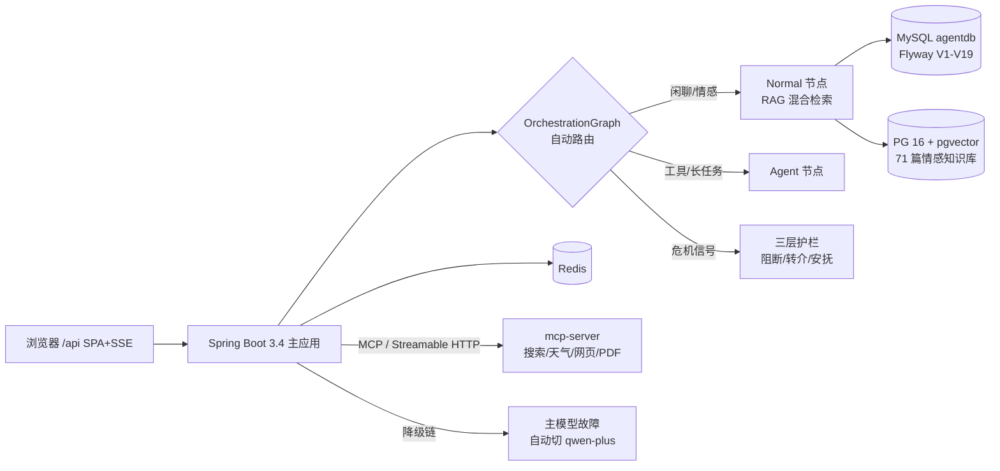

<p align="center">
  
  
  
  
  
  
  
  
  
  
</p>

<h1 align="center">💌 LoveHelping · 恋爱解忧</h1>

<p align="center">
  <b>一个认真听你说话、也认真替你出主意的 AI 情感陪伴助手。</b><br/>
  深夜的纠结 · 说不出口的话 · 放不下的关系 —— 都值得一封信的位置。
</p>

<p align="center">
  <a href="#-功能特性">功能特性</a> · <a href="#-快速开始">快速开始</a> ·
  <a href="#-环境变量">环境变量</a> · <a href="#-文档">文档</a> ·
  <a href="#-系统架构">系统架构</a> · <a href="#-安全与护栏">安全与护栏</a> ·
  <a href="#-质量与评测">质量与评测</a>
</p>

> LoveHelping 基于 **Spring AI + 多智能体协作**构建：领域问题检索知识库、任务问题自动调度 Agent 工具、情感危机有护栏兜底。开箱即用：`docker compose up -d` 五秒读懂依赖、一杯咖啡完成部署。

---

## ✨ 功能特性

| | | |
|---|---|---|
| 💌 **恋爱解忧** | 🧭 **智能路由，不分难度** | 🎭 **角色模拟屋** |
| 71 篇精选情感内容构建知识库，**混合检索**（jieba 分词 RRF + pgvector 语义）自动引用回答，句句有出处 | 一张图自动分发：闲聊 / 知识问答 / 工具任务全自动（`OrchestrationGraph`），**用户永远只需要"写一封信"** | 预置 8 种人设 + 自定义性格 / 关系阶段，把想说的话**先练一遍**再开口（TA 还有独立记忆） |
| 🧠 **长期记忆档案** | 🛡️ **三层安全护栏** | 🔧 **Agent 工具面** |
| 偏好、经历自动沉淀成记忆卡片，随时**核对 / 修正 / 删除**；AI 越聊越懂你 | 操控（PUA）识别 · 危机关键词全天转介 · 深夜情绪刹车 —— 是陪伴，更是边界 | 搜索 / 天气 / 网页抓取 / PDF 生成 / 约会方案，独立 MCP 进程承载，**故障不放大** |
| 🎮 **打字机全链路体验** | 🔁 **自我进化** | 🐳 **一键部署** |
| 不只是回答——排队告知"等 X 秒"、错误提示也逐字呈现；信笺风 UI 从首页到个人中心一以贯之 | 反思调度定期复盘对话，自动沉淀 Prompt 与技能版本（evolution_skill） | `Dockerfile × 2 + docker-compose`：MySQL / pgvector / Redis / MCP / App 一条命令拉起 |

## 🖼 界面预览

> 项目运行后访问 `http://localhost:8088/api/`。以下为功能入口总览（截图欢迎以 PR 形式补充至 `docs/screenshots/`）：

| 入口 | 定位 | 对应路由 |
|---|---|---|
| 📮 解忧信箱 | 统一对话入口（自动路由，支持打字机 / 排队告知） | `/love-chat` |
| 🎭 角色模拟屋 | 自定义情境与 TA 排练对话 + TA 的记忆管理 | `/sandbox` |
| 🧠 记忆档案 | AI 记住的关于你的事：分类 / 置信度 / 修正 | `/memory` |
| 🏠 我的小窝 | 头像（emoji）· 昵称 · 签名 · 改密码 · 账号注销 | `/profile` |
| 📚 旧信存档 | 历史会话回顾与续写 | `/history` |

## 🚀 快速开始

### A. Docker 一键部署（推荐）

```bash
# 1. 准备密钥
cp .env.example .env        # 填入 6 个必填项（见下方环境变量表）

# 2. 构建并启动（首次自动拉取镜像 + 编译）
docker compose up -d --build

# 3. 等就绪（首次 PG 全量向量化约 3-10 分钟）
docker compose logs -f app

# 4. 打开
open http://localhost:8088/api/
```

> ✅ 首次启动自动完成：MySQL Flyway 迁移（V1-V19）、PostgreSQL 建表 + **71 篇文档自动向量化**（增量按 doc_hash，重启只同步变更）。

### B. 本地开发

```bash
# 后端（默认 profile=local；依赖本地 MySQL/PG(pgvector)/Redis + mcp-server:8125）
./mvnw spring-boot:run

# 前端热更新
cd front && npm install && npm run dev   # → http://localhost:5173（proxy 到后端 /api）

# 冒烟回归（需后端在跑）
BASE_URL=http://localhost:8088/api ADMIN_API_KEY=xxx bash scripts/e2e-smoke.sh
```

## ⚙️ 环境变量

| 变量 | 必填 | 说明 | 示例 |
|---|---|---|---|
| `OPENAI_API_KEY` | ✅ | 主模型 key（默认智谱 BigModel，glm-4-flash） | `xxxxxxxx.watMU...` |
| `DASHSCOPE_API_KEY` | ✅ | 检索 embedding + 降级备模型（qwen-plus） | `sk-xxxx` |
| `JWT_SECRET` | ✅ | JWT 签名密钥，**≥32 字符随机串**（缺失拒绝启动） | `openssl rand -hex 32` |
| `MYSQL_PASSWORD` | ✅ | MySQL root 密码（首启创建） | `change-me` |
| `PGVECTOR_PASSWORD` | ✅ | PostgreSQL 密码（首启创建） | `change-me` |
| `ADMIN_API_KEY` | ✅ | 管理端点请求头 `X-Admin-Key` | `change-me` |
| `OPENAI_MODEL` / `OPENAI_BASE_URL` | ⭕ | 覆盖主模型 / 端点 | `glm-4.7` |
| `APP_PORT` | ⭕ | 对外端口 | `8088` |

## 📚 文档

从需求到部署的完整决策链沉淀在 `docs/`（含 ADR 与技术选型裁决）：

| 文档 | 内容 |
|---|---|
| [00 · 文档导读](docs/00-文档导读.md) | 阅读路线图 |
| [01 · 产品定位](docs/01-产品定位与需求.md) · [02 · 架构](docs/02-架构设计.md) | 为什么做 / 怎么搭 |
| [03 · ADR 决策记录](docs/03-技术决策记录.md) | 20+ 条技术裁决（父子索引为何放弃、降级链怎么落地…）|
| [07 · 安全与合规](docs/07-安全与合规.md) | 内容安全 / 数据合规 / 域外规则 |
| [08 · 可观测](docs/08-可观测性与发布.md) · [09 · 测试策略](docs/09-测试策略.md) | 指标 trace / 压测 NFR |
| [10 · 部署发布](docs/10-部署发布.md) | Docker 编排 / **CD 流水线** / **灾备运维手册**（备份恢复·Sentry·密钥轮换）/ FAQ |

## 🏗 系统架构



- **路由**：前端不做"简单/困难"之分——`classify` 在服务端按意图分发，RAG / 工具 / 纯聊天对用户透明。
- **记忆**：对话自动萃取事实 → 记忆档案；沙盘 TA 拥有独立记忆上下文。
- **工具面**：`mcp-server` 独立进程（端口 8125），主应用经 HTTP 调用——工具故障不放大为聊天故障。
- **前端**：Vue 3 + Vite，产物编译进后端静态目录，单 jar 交付。

## 🛡 安全与护栏

区别于一般"AI 聊天壳"，本项目把**边界**做成了产品能力：

| 层 | 机制 |
|---|---|
| 🚨 危机干预（L3） | 自伤 / 轻生类关键词 **全天 24h 硬阻断** + 专业转介话术（含口语变体库，持续补充）|
| 🧊 情绪刹车 | 深夜脆弱时段对"想死 / 撑不下去"等信号自动降级安抚，不机械背台词 |
| 🚷 操控识别 | PUA / 煤气灯话术识别阻断 + 亲密关系暴力内容合规（V17 意图护栏）|
| 🔌 域外拦截 | 非情感领域请求规则化拒绝（零 LLM 成本，防 prompt 越权）|
| 🔐 工程安全 | JWT fail-fast（无兜底密钥）· SSRF / 路径穿越防护 · 降级链故障注入实测 · 并发闸门（满则快速拒绝并告知等待）|

## 📊 质量与评测

自动化资产全部随仓库维护（`scripts/`）：

- 🎯 **检索评测**：45 例 ground-truth，生产基线 **Recall 1.00 / MRR 0.911**
- 🧪 **答案评测**：16 golden × 3 轮（期望内容含多跳）
- 🤖 **Agent 评测**：6 类三层边界（工具调用 / 域外 / 内容安全）全过
- 🚀 **E2E 冒烟**：18 项（注册 → SSE 打字机 → RAG → Agent → 护栏 → 降级）一键回归
- ⚡ **容量实测**：并发 40 零 429（厂商无硬限流）；闸门默认 24 路（P95 ≈3.5s 平衡点）；SSE 50 路长连接 0 断连

### 工程与运维（2026-09-07 企业级四课）

- ✅ **单测 105**：接口层秒级回归网——Auth(10)/Sandbox(7)/MemoryFacts(7) 契约 + RBAC 拦截器四态，越权 403/404/未登录 401 全部钉死
- 🔄 **CI 三层流水线**（GitHub Actions）：`gitleaks` 密钥扫描（全历史）→ `mvn test` → E2E 18 项（mysql/pgvector/redis service 容器，配置 Secrets 后自动全量回归）
- 📦 **CD**：`git tag v*` → 构建双镜像推送 GHCR → （可选）ssh 自动部署；`TAG=旧版本` 一键回滚
- 📜 **审计日志**：敏感操作（登录/改密/注销/删除）append-only 落表，`/admin/audit` 可查——**谁在几点做了什么都有据可查**
- 🧯 **灾备**：3-2-1 备份脚本（`ops/backup.sh`，7 日轮转）+ 恢复演练手册 + Sentry 错误追踪（填 `SENTRY_DSN` 即启用）
- 🔐 **RBAC**：方法级 `@RequireRole`（拦截器真校验，非前端藏菜单）——后续 ADMIN 能力的权限底座

## 🗂 目录结构

```
├── src/main/java/cn/lwx/lwxaiagent
│   ├── agent/               # Agent 工具面（搜索/天气/网页/PDF…）
│   ├── infrastructure/      # LLM 网关（降级链）、图编排、调度器
│   ├── rag/                 # 混合检索（jieba RRF + pgvector）、知识库同步
│   ├── sandbox/  memory/    # 角色模拟屋 / 记忆萃取
│   ├── harness/             # 护栏（governance）、可观测、评测
│   └── controller/          # REST + SSE API（/api 前缀）
├── front/src               # Vue 3 前端（信笺风 UI）
├── mcp-server/             # 独立工具面进程（Docker 单独构建）
├── scripts/                # 评测 / 冒烟 / 压测资产
├── docs/                   # 产品 → 架构 → ADR → 部署 全决策链
└── docker-compose.yml      # 一键部署
```

## 🤝 贡献

项目处于 V1 发布期。欢迎：

- 🐛 报 bug（危机词口语变体、RAG 漏召回的 ground-truth 样例尤佳）
- 💡 新人格模板 / 知识库内容
- 📸 界面截图与视觉打磨

提交前请跑 `scripts/e2e-smoke.sh`（18 项需全绿）。

---

<p align="center">
  <sub>每个深夜的纠结，都值得一封信的位置。</sub><br/>
  <a href="#">↑ 回到顶部</a>
</p>
