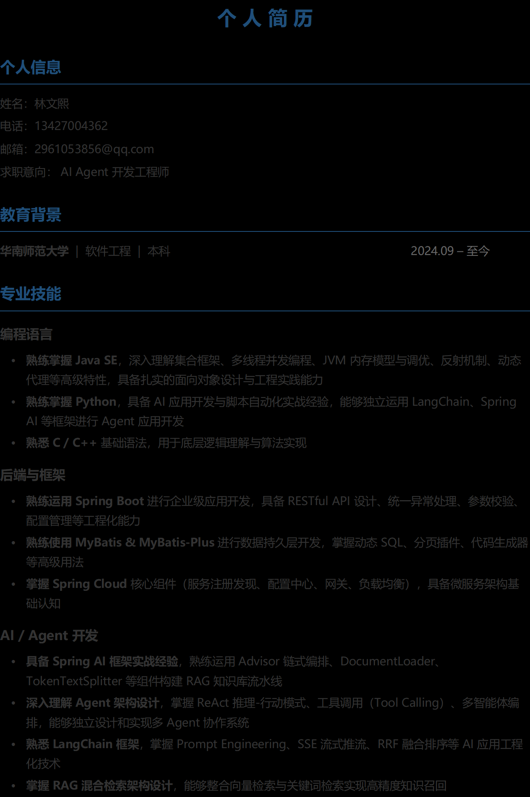

<!DOCTYPE html>
<html lang="zh-CN">
<head>
<meta charset="UTF-8">
<meta name="viewport" content="width=device-width, initial-scale=1.0">
<title>个人简历 - LoveHelping-AI 智能体项目</title>

</head>
<body>

<h1>XXX</h1>

Java 后端开发 / 全栈工程师 · XXX 年经验

  <h2>项目经历</h2>
  
LoveHelping-AI · 企业级 AI 情感咨询服务平台

  
Spring Boot 3.4 / Spring AI / DeepSeek V4 / DashScope / Vue 3 / MySQL / PgVector / Milvus / ES / MCP

  

    基于 Manus 智能体架构 + Spring AI，基本覆盖 Harness 框架核心层次（工具接口、上下文管理、智能体编排、可观测性、安全治理），构建多智能体协作系统。集成 ReAct 模式 Agent、混合检索 RAG、自我进化机制，提供有记忆、能反思、可进化的 AI 咨询服务。
  

  <ul>
    <li>
      智能体架构设计与流式改造：参考 Manus 智能体思想实现 LoveManus 工具调用 Agent，基于 ReAct 模式编排任务流程，支持网页搜索、图片搜索下载、PDF 生成、知识库检索等自定义工具。实现 Agent 状态机（IDLE→RUNNING→FINISHED/ERROR），覆盖完整生命周期管理。Streaming
      重写智能体流式执行循环，从 <code>.call()</code> 阻塞调用改造为 <code>.stream()</code> + SSE 实时推流，对话体验从整块等待降至逐 token 流式渲染。
    </li>
    <li>
      混合检索增强生成：整合 Milvus 向量检索 + Elasticsearch BM25 关键词检索 + PostgreSQL pgvector，通过 RRF 融合排序。实现查询重写与关键词增强，自定义分片策略与上下文增强器，提升检索准确率。
      Hybrid RAG
    </li>
    <li>
      自我进化闭环：设计 DB 轮询（@Scheduled 5min）替代内存定时器的企业级方案，对空闲/超时对话进行 LLM 反思萃取，形成结构化 skill 经验（名称 + 触发条件 + 具体做法），存入 MySQL + 向量库，下次对话检索注入 system prompt，实现持续进化。
      Self-Evolution
    </li>
    <li>
      全链路工程落地：统一响应格式与全局异常处理，MCP 多服务集成（高德地图、百度搜索），Spring AI Advisor 链式编排（日志 / 安全 / 记忆），自定义 DocumentLoader + TokenTextSplitter 实现知识库文档流水线加载，OpenTelemetry 全链路追踪（Langfuse），JWT 多租户隔离，DB 限流，Guardrail 安全治理（提示注入检测）。前后端分离，Vite 构建自动输出至 Spring Boot 静态资源目录，SPA 路由统一 fallback。
    </li>
  </ul>
  

    
<h3>后端</h3>
Spring Boot / Spring AI / MyBatis-Plus / MySQL / Redis

    
<h3>AI / 模型</h3>
DeepSeek V4 / DashScope / 流式 SSE / 多 Agent 协作

    
<h3>检索</h3>
Milvus / ES / PgVector / RRF 融合 / 查询重写

    
<h3>前端 &amp; DevOps</h3>
Vue 3 / Vite / EventSource / MCP / OpenTelemetry

  

</body>
</html>
